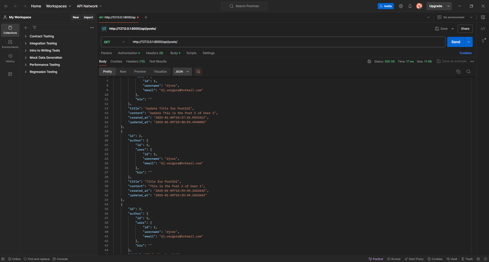

# Тестовое задание

Добро пожаловать! Это тестовое задание предназначено для проверки ваших навыков работы с Django и ReactJS. Пожалуйста, внимательно ознакомьтесь с требованиями, выполните задание и сдайте его через Pull Request.

## Цель

Создать веб-приложение с использованием **Django** для backend и **ReactJS** для frontend. Оно должно включать работу с моделями, реализацию CRUD-операций, авторизацию с токеном и базовую стилизацию.

---

## Требования

### 1. **Backend** (Django)

- Создайте Django-приложение с использованием Django REST Framework.
- Реализуйте модели (не менее 2 моделей с отношением).
- Настройте CRUD-методы:
  - **GET**
  - **POST**
  - **PUT**
  - **PATCH**
  - **DELETE**
- Настройте авторизацию с использованием токенов (например, через JWT или DRF токен-авторизацию).

### 2. **Frontend** (ReactJS)

- Создайте ReactJS-приложение.
- Реализуйте взаимодействие с backend с использованием API (CRUD-операции).
- Реализуйте авторизацию:
  - Форма входа с сохранением токена.
  - Защищенные маршруты.
- Стилизация должна быть выполнена на уровне **Bootstrap**, но **без использования сторонних CSS-библиотек** (например, Styled Components и Material-UI не использовать).

---

## Задачи для выполнения

### Backend:

1. Настроить Django проект и приложение.
2. Создать базу данных и модели.
3. Реализовать сериализаторы и маршруты.
4. Настроить эндпоинты для всех CRUD операций.
5. Настроить авторизацию и защиту маршрутов.

### Frontend:

1. Настроить React проект.
2. Реализовать компоненты для CRUD операций.
3. Реализовать авторизацию с хранением токена.
4. Выполнить базовую стилизацию.

---

## Рекомендации по структуре репозитория

Структура вашего репозитория должна быть следующей:

root/

- backend/ # Django проект
  - manage.py
  - requirements.txt
  - <файлы приложения>
- frontend/ # React проект
  - package.json
  - public/
  - src/
- README.md

## Критерии оценки

Ваше решение будет оцениваться по следующим критериям:

### 1. **Функциональность**

- Корректная работа всех реализованных CRUD-операций.
- Работоспособность авторизации с токеном.
- Корректное взаимодействие между backend и frontend.

### 2. **Качество кода**

- Чистота и читаемость кода (понятные названия переменных, функций, классов).
- Логическая организация проекта и файлов.
- Наличие комментариев, если они действительно помогают понять сложные участки кода.

### 3. **Структура проекта**

- Соответствие рекомендуемой структуре репозитория (backend и frontend находятся в отдельных папках, их запуск независим друг от друга).
- Использование стандартных практик и подходов для Django и ReactJS.

### 4. **Работа с API**

- Правильное и безопасное использование API: обработка ошибок, валидация данных.
- Удобство и интуитивность API интерфейсов (например, правильные HTTP-методы, понятные URL-эндпоинты).

### 5. **Авторизация**

- Корректная работа с токенами: их выдача, проверка и использование для доступа к защищенным маршрутам.
- Реализация функционала входа и выхода на frontend.

### 6. **Стилизация**

- Уровень стилизации: приложение должно выглядеть аккуратно и быть удобно читаемым.
- Отсутствие сторонних библиотек для стилей (кроме Bootstrap как ориентира).

### 7. **Документация**

- Наличие и качество README файла:
  - Инструкция по запуску backend и frontend.
  - Описание основных функций и структуры проекта.
- При необходимости — дополнительная документация (например, описание API).

### 8. **Индивидуальный подход**

- Творческий подход и дополнительные улучшения (необязательные, но приветствуются).
- Решения, показывающие понимание технологий и их возможностей.

---

Результат должен быть сдан через Pull Request в данный репозиторий.
Обязательно укажите ваши контакты. Удачи!

# Описание проекта

## Обзор

Этот проект представляет собой полнофункциональное веб-приложение, состоящее из бэкенда, разработанного с использованием Django, и фронтенда, разработанного с использованием React. Приложение предназначено для управления аутентификацией пользователей, созданием и отображением постов, а также для административного интерфейса управления контентом.

## Бэкенд

- **Фреймворк**: Django
- **Структура каталогов**:
  - `backend/`: Содержит все файлы, относящиеся к бэкенду.
    - `manage.py`: Утилита командной строки для управления проектом Django.
    - `requirements.txt`: Список зависимостей, необходимых для бэкенда.
    - `api/`: Содержит приложение Django, отвечающее за обработку API-запросов.
      - `models.py`: Определяет модели данных для приложения.
      - `views.py`: Содержит логику обработки запросов и возврата ответов.
      - `serializers.py`: Управляет преобразованием сложных типов данных в JSON.
      - `tests.py`: Содержит модульные тесты для API.
      - `migrations/`: Содержит файлы миграции для изменений схемы базы данных.
    - `backend/`: Содержит основные настройки и конфигурации проекта Django.
      - `settings.py`: Конфигурирует настройки проекта Django.
      - `urls.py`: Определяет маршрутизацию URL для приложения.
      - `wsgi.py` и `asgi.py`: Точки входа для WSGI и ASGI серверов.

## Фронтенд

- **Фреймворк**: React
- **Структура каталогов**:
  - `frontend/`: Содержит все файлы, относящиеся к фронтенду.
    - `package.json`: Список зависимостей и скриптов для React-приложения.
    - `public/`: Содержит статические файлы, такие как HTML и изображения.
      - `index.html`: Основной HTML-файл для React-приложения.
    - `src/`: Содержит исходный код для React-приложения.
      - `components/`: Содержит переиспользуемые компоненты React.
        - `Navbar.tsx`: Компонент навигационной панели.
        - `PrivateRoute.tsx`: Компонент для защиты маршрутов.
      - `pages/`: Содержит различные страницы приложения.
        - `Dashboard.tsx`: Страница панели управления для вошедших пользователей.
        - `Login.tsx`: Страница входа для аутентификации пользователей.
        - `Posts.tsx`: Страница для отображения и управления постами.
      - `services/`: Содержит файлы сервисов API для выполнения HTTP-запросов.
        - `api.ts`: Определяет функции для взаимодействия с бэкенд API.
      - `styles/`: Содержит CSS-файлы для стилизации приложения.

## База данных

- **База данных**: SQLite
- Файл базы данных `db.sqlite3` находится в каталоге `backend/`, храня все данные приложения.

## Тестирование

- Проект включает тестовые изображения, расположенные в каталоге `testImages/`, которые используются для визуального тестирования приложения.

### Обзор технологий:

**Frontend:** React, TypeScript, Bootstrap, CSS.
**Backend:** Django, Python, REST API, JWT, Axios.
**Interface for Test:** Visual Studio Code, Pycharm, POSTMAN.

## Заключение

Этот проект структурирован для обеспечения бесшовного пользовательского опыта, с надежным бэкендом для управления данными и динамичным фронтендом для взаимодействия с пользователем. Использование Django и React позволяет эффективно разрабатывать и масштабировать приложение, что делает его подходящим для различных веб-приложений.

## Тестовые изображения

### Бэкэнд-тестирование с помощью POSTMAN:

#### a. CREATE нового пользователя:


#### b. DELETE пост:


#### c. GET токен администратора:


#### d. GET пост:



#### e. POST пост:


#### f. PUT пост:


### Прототип фронтэнда:

#### a. Страница входа в систему:


#### b. Страница приборной панели:


#### c. Страница список постов:


### Соображения перед внедрением:

- Убедитесь, что в переменной API_URL указано имя порта бэкенда или домена (/frontend/src/services/api.ts)

Для этого проекта была использована yarn, так:

```
yarn start
```
